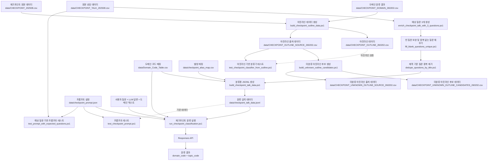

# AIA Checkpoint With LLM

## 프로젝트 개요

이 프로젝트는 상담 데이터와 도메인/목차 매핑 데이터를 기반으로 체크포인트를 탐색하고 분류하기 위한 데이터셋 생성, 아웃라인 집계, 프롬프트 검증, 분류 실행 스크립트를 포함합니다.

현재 프로젝트 범위는 아래 네 가지로 정리할 수 있습니다.

- 상담 원본 데이터에서 예상 질문을 생성하고 분류용 JSONL을 구축
- 도메인별 목차와 연결된 체크포인트를 아웃라인 데이터로 집계
- LLM + 프롬프트 엔지니어링으로 목차 Top1 탐색 정확도를 검증
- 추가 AI 기술을 포함한 탐색 정확도 고도화 방안을 문서화

## 문서 안내

- [전체 흐름 문서](docs/checkpoint-flow.md): 데이터 준비, 아웃라인 생성, 검증, 분류 실행의 단계별 흐름
- [탐색 정확도 고도화 문서](docs/advanced-retrieval-design.md): Top1 목차 탐색 정밀도를 높이기 위한 하이브리드 검색, 재정렬, 랭킹 모델 설계


체크포인트 상담 데이터와 도메인/목차 매핑 데이터를 정리해, 다음 작업을 수행하는 스크립트 모음입니다.

- `CHECKPOINT_TALK` CSV에서 상담 본문과 예상 질문 데이터를 정제
- 체크포인트 제목을 `topic_code`, `domain_code`에 매핑해 JSONL 생성
- 고객 예상 질문 1개 또는 3개 생성, 공란 보완, 중복 제거
- `CHECKPOINT_DOMAIN` 입력으로 목차별 질문 묶음(`CHECKPOINT_OUTLINE`) 생성
- 매핑되지 않은 `UNKNOWN` 질문을 별도 후보군으로 추출
- OpenAI Responses API 기반 체크포인트 분류 프롬프트 실행 및 테스트

## 디렉터리 구조

- [`data`](data): 원본 CSV, 코드 매핑 테이블, 프롬프트 템플릿, 중간/최종 산출물
- [`scripts`](scripts): PowerShell 래퍼, 데이터 정제 스크립트, 분류 테스트 스크립트
- [`docs`](docs): 전체 흐름, 탐색 정확도 고도화 설계 문서

## 주요 데이터 파일

- [`data/CHECKPOINT_TALK_202508.csv`](data/CHECKPOINT_TALK_202508.csv): 상담 원본 CSV
- [`data/CHECKPOINT_202508.csv`](data/CHECKPOINT_202508.csv): 체크포인트 제목/도메인 기준 데이터
- [`data/CHECKPOINT_DOMAIN_260202.csv`](data/CHECKPOINT_DOMAIN_260202.csv): 도메인 분류 입력 데이터
- [`data/Domain_Code_Table.csv`](data/Domain_Code_Table.csv): 목차 코드와 도메인 코드 매핑
- [`data/checkpoint_alias_map.csv`](data/checkpoint_alias_map.csv): 제목 alias 매핑
- [`data/checkpoint_prompt.json`](data/checkpoint_prompt.json): 분류 프롬프트 템플릿
- [`data/checkpoint_talk_data.jsonl`](data/checkpoint_talk_data.jsonl): 분류용 상담 JSONL
- [`data/CHECKPOINT_OUTLINE_260202.csv`](data/CHECKPOINT_OUTLINE_260202.csv): 목차별 질문 집계 결과
- [`data/CHECKPOINT_OUTLINE_SOURCE_260202.csv`](data/CHECKPOINT_OUTLINE_SOURCE_260202.csv): 질문별 목차 매핑 상세 결과
- [`data/CHECKPOINT_UNKNOWN_OUTLINE_CANDIDATES_260202.csv`](data/CHECKPOINT_UNKNOWN_OUTLINE_CANDIDATES_260202.csv): `UNKNOWN` 질문 후보 요약

## 실행 환경

- Windows PowerShell 또는 PowerShell 7
- `Microsoft.VisualBasic.FileIO.TextFieldParser` 사용 가능 환경
- Node.js
  - `build_checkpoint_outline_data.ps1`
  - `build_unknown_outline_candidates.ps1`
  - `test_checkpoint_classifier_from_outline.ps1`
- OpenAI API 호출이 필요한 경우 `OPENAI_API_KEY`
- 기본 모델: `gpt-4.1-mini`

환경 변수 예시:

```powershell
$env:OPENAI_API_KEY = "YOUR_API_KEY"
$env:OPENAI_MODEL = "gpt-4.1-mini"
```

프록시 또는 호환 엔드포인트를 쓰는 경우:

```powershell
$env:OPENAI_BASE_URL = "https://api.openai.com/v1"
```

## 주요 스크립트

### 1. 상담 데이터 정제

- [`scripts/enrich_checkpoint_talk_with_expected_question.ps1`](scripts/enrich_checkpoint_talk_with_expected_question.ps1): 고객 예상 질문 1개 생성
- [`scripts/enrich_checkpoint_talk_with_3_questions.ps1`](scripts/enrich_checkpoint_talk_with_3_questions.ps1): 고객 예상 질문 3개 생성
- [`scripts/fill_blank_questions_unique.ps1`](scripts/fill_blank_questions_unique.ps1): 비어 있는 질문 컬럼만 채움
- [`scripts/dedupe_questions_by_title.ps1`](scripts/dedupe_questions_by_title.ps1): 같은 제목 그룹 내 질문 중복 제거
- [`scripts/build_checkpoint_talk_data.ps1`](scripts/build_checkpoint_talk_data.ps1): 상담 CSV를 JSONL로 변환

### 2. 아웃라인/목차 데이터 생성

- [`scripts/build_checkpoint_outline_data.ps1`](scripts/build_checkpoint_outline_data.ps1): `CHECKPOINT_DOMAIN` 입력을 목차별 집계 CSV로 변환
- [`scripts/build_unknown_outline_candidates.ps1`](scripts/build_unknown_outline_candidates.ps1): `UNKNOWN`으로 남은 질문에서 기존 목차 후보 추출

### 3. 프롬프트 및 분류 테스트

- [`scripts/test_checkpoint_prompt.ps1`](scripts/test_checkpoint_prompt.ps1): 샘플 입력 기준 프롬프트 렌더링 검증
- [`scripts/test_prompt_with_expected_questions.ps1`](scripts/test_prompt_with_expected_questions.ps1): 예상 질문 컬럼을 이용한 프롬프트 치환 검증
- [`scripts/run_checkpoint_classification.ps1`](scripts/run_checkpoint_classification.ps1): 단건 분류 실행
- [`scripts/test_checkpoint_classifier_from_outline.ps1`](scripts/test_checkpoint_classifier_from_outline.ps1): 아웃라인 데이터 기준 분류 정확도 검증

## 작업 흐름

### 전체 Flowchart

- [상세 흐름 문서](docs/checkpoint-flow.md): 전체 flowchart 단계별 설명, 입력/출력 파일, 실행 순서 정리
- [탐색 정확도 고도화 문서](docs/advanced-retrieval-design.md): Top1 목차 탐색 정밀도를 높이기 위한 추가 AI 기술과 권장 아키텍처



### 상담 데이터 기반 분류용 데이터셋 준비

1. [`data/CHECKPOINT_TALK_202508.csv`](data/CHECKPOINT_TALK_202508.csv)에 예상 질문 3개를 생성합니다.
2. 필요하면 비어 있는 질문만 추가로 채웁니다.
3. 제목별 중복 질문을 제거합니다.
4. JSONL을 생성합니다.
5. 프롬프트 테스트 또는 실제 분류를 실행합니다.

```powershell
.\scripts\enrich_checkpoint_talk_with_3_questions.ps1
.\scripts\fill_blank_questions_unique.ps1
.\scripts\dedupe_questions_by_title.ps1
.\scripts\build_checkpoint_talk_data.ps1
```

### 도메인 분류 결과를 목차 아웃라인으로 집계

1. [`data/CHECKPOINT_DOMAIN_260202.csv`](data/CHECKPOINT_DOMAIN_260202.csv)를 입력으로 목차 집계 파일을 생성합니다.
2. `UNKNOWN`으로 남은 질문만 별도 후보군으로 추출합니다.
3. 필요하면 아웃라인 데이터 기준으로 분류기를 테스트합니다.

```powershell
.\scripts\build_checkpoint_outline_data.ps1
.\scripts\build_unknown_outline_candidates.ps1
.\scripts\test_checkpoint_classifier_from_outline.ps1
```

## 사용 예시

### 1. JSONL 생성

```powershell
.\scripts\build_checkpoint_talk_data.ps1
```

기본 입력:

- [`data/CHECKPOINT_TALK_202508.csv`](data/CHECKPOINT_TALK_202508.csv)
- [`data/Domain_Code_Table.csv`](data/Domain_Code_Table.csv)
- [`data/checkpoint_alias_map.csv`](data/checkpoint_alias_map.csv)

기본 출력:

- [`data/checkpoint_talk_data.jsonl`](data/checkpoint_talk_data.jsonl)

다른 경로를 쓰려면:

```powershell
.\scripts\build_checkpoint_talk_data.ps1 `
  -InputCsv "data/CHECKPOINT_TALK_202508.csv" `
  -MappingCsv "data/Domain_Code_Table.csv" `
  -AliasCsv "data/checkpoint_alias_map.csv" `
  -OutputJsonl "data/checkpoint_talk_data.jsonl"
```

### 2. 예상 질문 3개 생성

```powershell
.\scripts\enrich_checkpoint_talk_with_3_questions.ps1 `
  -InputCsv "data/CHECKPOINT_TALK_202508.csv" `
  -OutputCsv "data/CHECKPOINT_TALK_202508.csv"
```

이 스크립트는 `고객예상질문1~3` 컬럼을 만들거나 갱신합니다.

### 3. 비어 있는 질문만 채우기

```powershell
.\scripts\fill_blank_questions_unique.ps1 `
  -InputCsv "data/CHECKPOINT_TALK_202508.csv" `
  -OutputCsv "data/CHECKPOINT_TALK_202508.csv"
```

기존 질문은 유지하고 빈 칸만 채웁니다.

### 4. 목차 아웃라인 생성

```powershell
.\scripts\build_checkpoint_outline_data.ps1 `
  -InputCsv "data/CHECKPOINT_DOMAIN_260202.csv" `
  -CheckpointCsv "data/CHECKPOINT_202508.csv" `
  -OutputCsv "data/CHECKPOINT_OUTLINE_260202.csv" `
  -OutputDetailCsv "data/CHECKPOINT_OUTLINE_SOURCE_260202.csv"
```

생성 결과:

- [`data/CHECKPOINT_OUTLINE_260202.csv`](data/CHECKPOINT_OUTLINE_260202.csv): 목차별 질문 수, 대표 질문, 예시 질문 3개
- [`data/CHECKPOINT_OUTLINE_SOURCE_260202.csv`](data/CHECKPOINT_OUTLINE_SOURCE_260202.csv): 질문 단위 매핑 상세와 `MATCHED`/`UNKNOWN`

### 5. `UNKNOWN` 후보 추출

```powershell
.\scripts\build_unknown_outline_candidates.ps1 `
  -InputCsv "data/CHECKPOINT_OUTLINE_SOURCE_260202.csv" `
  -OutputCsv "data/CHECKPOINT_UNKNOWN_OUTLINE_CANDIDATES_260202.csv" `
  -OutputDetailCsv "data/CHECKPOINT_UNKNOWN_OUTLINE_SOURCE_260202.csv"
```

### 6. 프롬프트 테스트

```powershell
.\scripts\test_checkpoint_prompt.ps1
.\scripts\test_prompt_with_expected_questions.ps1
```

### 7. 단건 분류 실행

```powershell
.\scripts\run_checkpoint_classification.ps1 `
  -UserQuestion "자동이체 계좌를 변경하고 싶어요." `
  -LlmAnswer "보험료 납입 계좌 변경 업무로 안내할 수 있습니다." `
  -DomainText "DOM003, DOM002, DOM001"
```

프롬프트만 확인하려면:

```powershell
.\scripts\run_checkpoint_classification.ps1 `
  -UserQuestion "자동이체 계좌를 변경하고 싶어요." `
  -LlmAnswer "보험료 납입 계좌 변경 업무로 안내할 수 있습니다." `
  -DomainText "DOM003, DOM002, DOM001" `
  -DryRun
```

### 8. 아웃라인 데이터 기준 분류기 테스트

```powershell
.\scripts\test_checkpoint_classifier_from_outline.ps1 `
  -InputCsv "data/CHECKPOINT_OUTLINE_SOURCE_260202.csv" `
  -OutputCsv "data/CHECKPOINT_CLASSIFIER_TEST_RESULTS_260202.csv" `
  -MaxRows 100 `
  -MaxContentRows 120
```

결과 CSV에는 기대 목차 코드와 예측 목차 코드를 함께 기록합니다.

## 분류 스크립트 동작 방식

[`scripts/run_checkpoint_classification.ps1`](scripts/run_checkpoint_classification.ps1)는 아래 순서로 동작합니다.

1. [`data/checkpoint_prompt.json`](data/checkpoint_prompt.json)에서 템플릿을 읽습니다.
2. `DomainText`에서 `DOM001` 형식의 후보 도메인을 추출합니다.
3. [`data/Domain_Code_Table.csv`](data/Domain_Code_Table.csv)와 [`data/checkpoint_talk_data.jsonl`](data/checkpoint_talk_data.jsonl)을 도메인 기준으로 필터링합니다.
4. 사용자 질문, LLM 응답, 도메인 후보, 체크포인트 메타데이터, 상담 본문을 조합해 프롬프트를 렌더링합니다.
5. `OPENAI_BASE_URL`이 있으면 해당 엔드포인트를, 없으면 `https://api.openai.com/v1`를 사용합니다.
6. Responses API 결과의 `output_text`를 JSON으로 해석해 최종 분류 결과를 확인합니다.

## 주의사항

- 텍스트 파일은 UTF-8을 기준으로 사용합니다.
- [`data/CHECKPOINT_TALK_202508.csv`](data/CHECKPOINT_TALK_202508.csv)는 첫 줄이 섹션 행, 둘째 줄이 헤더라는 전제를 사용합니다.
- 예상 질문 생성 계열 스크립트는 입력 파일을 직접 덮어쓸 수 있습니다.
- 아웃라인 생성/후보 추출/분류기 테스트 스크립트는 `node` 실행이 가능해야 합니다.
- OpenAI API를 호출하는 스크립트는 네트워크와 유효한 API 키가 필요합니다.
